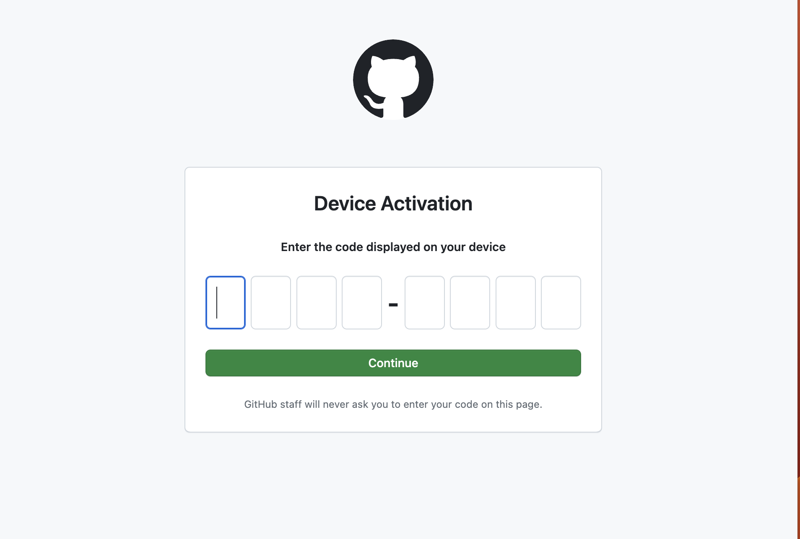
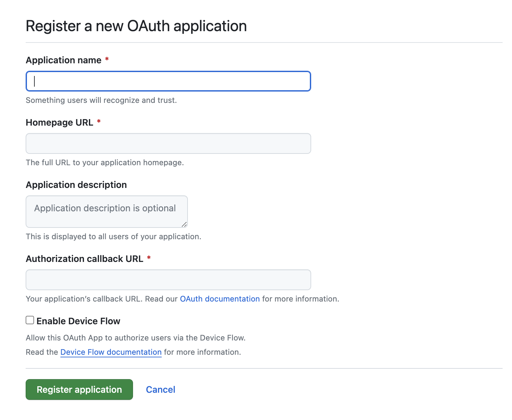

+++
title = "🦀 RFC8628 OAuth 2.0 Device Authorization GrantでCLIからGithubのaccess tokenを取得する"
slug = "rfc8628-oauth2-device-authorization-grant-handson"
description = "通称Device flowをRustで実装する"
date = "2023-11-18"
draft = false
[taxonomies]
tags = ["rust"]
[extra]
image = "images/emoji/crab.png"
+++

本記事では[RFC8628 OAuth 2.0 Device Authorization Grant](https://datatracker.ietf.org/doc/html/rfc8628)を読みながらGithubのaccess tokenを取得するCLIをrustで実装していきます。

作成したCLIは[こちら](https://github.com/ymgyt/yaru/blob/078649cb201a7adafcbed4e3633bdb3a7b846553/yaru/src/cli/login/oauth.rs#L33)

## 概要

CLIから[OAuth](https://datatracker.ietf.org/doc/html/rfc6749)の[authorization code grant](https://datatracker.ietf.org/doc/html/rfc6749#section-4.1)や[implicit grant](https://datatracker.ietf.org/doc/html/rfc6749#section-4.2)を利用して、Github等のauthorization serverからaccess tokenを取得したい場合、userがCLI applicationへの権限委譲に同意したあと、authorization serverからのredirectをうけるhttp serverが必要になります。  
CLIの場合、localhostでlistenしているhttp serverを起動しておき、authorization serverから`http://localhost:8080`等へredirectさせるという方法も考えられますが、以下の問題があると思いました。

* 指定のportでlistenできるとは限らない
* 同一hostでCLIを複数個同時に起動するとportが衝突する

Portが既に利用されている場合は、利用portをincrementして使えるportを見つける処理を行うことで、対応できるかなと考えていたところ、本仕様を見つけました。  
RFC8628を使えば、http serverを建てることなくOAuthの認可処理を行うことができたので、本記事ではrustで実装しながらその過程をみていこうと思います。

目標は以下の処理を実装することです。

```sh
# CLIから処理を起動
myapp login

Open `https://github.com/login/device` on your browser
Enter CODE: `5XXX-3YYY`
```

CLIを実行すると、code入力画面がbrowserに表示されるので



Github上の画面でcodeを入力すると、access tokenを取得できます。


## Device Authorization Grantとは

一言で説明すると、userの権限委譲を表すgrant codeをredirectによるinboundのhttp requestから取得するのではなく、authorization serverにpollingして取得する方式です。

仕様の[1 Introduction](https://datatracker.ietf.org/doc/html/rfc8628#section-1)では

> This OAuth 2.0 [RFC6749](https://datatracker.ietf.org/doc/html/rfc6749) protocol extension enables OAuth clients to
   request user authorization from applications on devices that have limited input capabilities or lack a suitable browser.
  
とあり、今回のCLIではhttp serverを用いない為、http requestを処理できないので、lack a suitable browserにあたるでしょうか。

また、

> The authorization flow defined by this specification, sometimes referred to as the "device flow", instructs the user to review the authorization request on a secondary device, such as a smartphone, which does have the requisite input and browser capabilities to complete the user interaction.

とあり、Device Authorization Grantはdevice flowとも呼ばれているようです。Githubでもdevice flowとして扱われていました。

そして

> The device authorization grant is not intended to replace browser-based OAuth in native apps on capable devices like smartphones.
   Those apps should follow the practices specified in "OAuth 2.0 for Native Apps" [RFC8252](https://datatracker.ietf.org/doc/html/rfc8252).

とあり、native app等ではdevice flowを使うべきではないようです。

## Requirements for device authorization grant

仕様に定義されている、device flowのための要求事項は

1. Internetに接続されていること
2. Outbound http requestができること
3. URIとcode sequenceをuserに表示できること
4. Userはrequestを処理するために別のdevice(personal computer, smartphone等)をもっていること

と定義されていました。  
CLIとしてはbrowserかsmartphoneをuserが使えることを期待するのは特に問題ないといえそうです。

## Device Authorization Grantの流れ

Device authorization grantにおいて、各種情報がどのようにやり取りされるかみていきます。[Introduction Figure 1](https://datatracker.ietf.org/doc/html/rfc8628#section-1)がわかりやすいので引用します。

```
      +----------+                                +----------------+
      |          |>---(A)-- Client Identifier --->|                |
      |          |                                |                |
      |          |<---(B)-- Device Code,      ---<|                |
      |          |          User Code,            |                |
      |  Device  |          & Verification URI    |                |
      |  Client  |                                |                |
      |          |  [polling]                     |                |
      |          |>---(E)-- Device Code       --->|                |
      |          |          & Client Identifier   |                |
      |          |                                |  Authorization |
      |          |<---(F)-- Access Token      ---<|     Server     |
      +----------+   (& Optional Refresh Token)   |                |
            v                                     |                |
            :                                     |                |
           (C) User Code & Verification URI       |                |
            :                                     |                |
            v                                     |                |
      +----------+                                |                |
      | End User |                                |                |
      |    at    |<---(D)-- End user reviews  --->|                |
      |  Browser |          authorization request |                |
      +----------+                                +----------------+

                    Figure 1: Device Authorization Flow
  
```

今回の場合、DeviceClientがCLI、Authorization ServerがGithubにあたります。

(A) まずuserによってcliが実行されると、cliはauthorization serverにdevice flowの開始を要求するrequestを送る。

(B) するとauthorization serverはuserのbrowserで表示すべきURI(verification URI)と入力するuser codeをresponseで返す

(C) CLIはbrowserを開いて、verification URIを表示して、user codeの入力を促す 

(D) Userはverification URI上で、CLIが委譲を要求する権限を確認して同意を判断する

(E) CLIはuserにverification URIとuser codeを表示した後はauthorization serverにpollingを行い、userの判断/入力の結果を待つ

(F) Userがuser codeの入力を完了すると、access tokenがauthorization serverからresponseとして返され、処理が完了する

CLIが実装するrequest/responseは2種類だけと非常にシンプルになっています。  
処理の概要が把握できたので、それぞれのステップを実装していきます。


## 事前準備

本記事ではauthorization serverとしてGithubを利用します。  
あらかじめ、CLIをGithubにOAuth applicationとして登録しておきます。

[Settings > Developer Settings > New OAuth App](https://github.com/settings/applications/new)

Enable Device Flowのcheckboxを有効にします。
Authorization callback URLはCLIのみの利用では使用しませんが、必須なので適当な値を設定しました。



設定が完了するとClient IDが振り出されるので控えておきます。

また、cargoのdependenciesは以下の通りです。

```toml
[dependencies]
anyhow = "1.0"
http = "0.2.9"
http-serde-ext = "0.1.6"
open = "5.0.0"
reqwest = { version = "0.11.22", features = ["rustls-tls-webpki-roots", "json"] }
serde = { version = "1.0.190",features = ["derive"] }
serde_json = "1.0.108"
tokio = { version = "1.32.0", features = ["rt-multi-thread", "macros", "time"] }
tracing = "0.1.37"
tracing-subscriber = { version = "0.3.17", default-features = false, features = ["smallvec", "fmt", "ansi", "std", "env-filter", "time"] }
```

## Device Authorization Request

まず本処理は`DeviceFlow`に実装していきます。

```rust
use reqwest::Client;
use std::time::Duration;

use crate::config;

pub struct DeviceFlow {
    client: Client,
    client_id: &'static str,
}

impl DeviceFlow {
    pub fn new() -> Self {
        let client = reqwest::ClientBuilder::new()
            .user_agent(config::USER_AGENT)
            .timeout(Duration::from_secs(5))
            .build()
            .unwrap();

        Self {
            client,
            client_id: config::github::CLIENT_ID,
        }
    }
}
```

* `config::USER_AGENT`にはapplicationのuser agentを設定
* `config::github::CLIENT_ID`にはGithubから振り出されたClient IDが定義されています

続いて、(A)の処理に該当するdevice authorization requestについてみていきます。  

[仕様の3.1 Device Authorization Request](https://datatracker.ietf.org/doc/html/rfc8628#section-3.1)には

> This specification defines a new OAuth endpoint: the device authorization endpoint.  This is separate from the OAuth authorization endpoint defined in [RFC6749](https://datatracker.ietf.org/doc/html/rfc6749) with which the user interacts via a user agent (i.e., a browser). 

とあり、device flowでは専用のendpointが定義されます。  
Githubでは`https://github.com/login/device/code`がdevice authorization endpointです。

仕様では、device authorization endpointに以下のrequestを行います。

```rust
/// https://datatracker.ietf.org/doc/html/rfc8628#section-3.1
#[derive(Serialize)]
struct DeviceAuthorizationRequest<'s> {
    client_id: &'s str,
    scope: &'s str,
}
```

* `client_id`: Githubに登録したCLIのClient ID
* `scope`: OAuthにおけるuserが委譲する権限の射程です。

Githubのscopeは[Scopes for OAuth apps](https://docs.github.com/en/apps/oauth-apps/building-oauth-apps/scopes-for-oauth-apps)に定義されていました。今回は`user:email`を利用します。

device authorization requestが成功すると以下のresponseをえます。(B)に該当します。

```rust
/// https://datatracker.ietf.org/doc/html/rfc8628#section-3.2
#[derive(Debug, Deserialize)]
struct DeviceAuthorizationResponse {
    /// device verification code
    device_code: String,
    /// end user verification code
    user_code: String,
    /// end user verification uri on the authorization server
    #[serde(with = "http_serde_ext::uri")]
    verification_uri: Uri,
    /// a verification uri that includes user_code which is designed for non-textual transmission.
    // error if there is no field on deserializing, maybe bug on http_serde_ext crate ?
    #[allow(unused)]
    #[serde(with = "http_serde_ext::uri::option", skip_deserializing)]
    verification_uri_complete: Option<Uri>,
    /// the lifetime in seconds of the device_code and user_code
    #[allow(unused)]
    expires_in: i64,
    /// the minimum amount of time in seconds that the client should wait between polling requests to the token endpoint
    /// if no value is provided, clients must use 5 as the default
    interval: Option<i64>,
}
```

* `device_code`は次のrequestで利用するcodeです。userには表示しません。
* `user_code` userに遷移先のbrowserで入力してもらうcodeです
* `verification_uri` userのbrowserの遷移先URIです
* `verification_uri_complete` QRコード等のtext以外の表示手段です。今回は利用しません。
* `expires_in` device codeのTTLです。この時間以内に処理を完了できなければ処理をやり直す必要があります。
* `interval` pollingする際のintervalです。仕様でdefaultが5秒と定められています。

device authorization requestは以下のように実装しました。

```rust
impl DeviceFlow {
    const DEVICE_AUTHORIZATION_ENDPOINT: &str = "https://github.com/login/device/code";

    #[tracing::instrument(skip(self))]
    pub async fn device_flow(self) -> anyhow::Result<DeviceAccessTokenResponse> {
        // https://docs.github.com/en/apps/oauth-apps/building-oauth-apps/scopes-for-oauth-apps
        let scope = "user:email";

        let response = self
            .client
            .post(Self::DEVICE_AUTHORIZATION_ENDPOINT)
            .header(http::header::ACCEPT, "application/json")
            .form(&DeviceAuthorizationRequest {
                client_id: self.client_id,
                scope,
            })
            .send()
            .await?
            .error_for_status()?
            .json::<DeviceAuthorizationResponse>()
            .await?;

        // ...
    }
}
```

> The client initiates the authorization flow by requesting a set of verification codes from the authorization server by making an HTTP "POST" request to the device authorization endpoint.
> The client makes a device authorization request to the device authorization endpoint by including the following parameters using the "application/x-www-form-urlencoded" format, per Appendix B of [RFC6749], with a character encoding of UTF-8 in the HTTP request entity-body:

とあるので、POSTかつ、form-urlencodedが仕様のようでした。  
Githubではjsonでも受け付けてくれそうでした。

また、responseに関しては

> In response, the authorization server generates a unique device verification code and an end-user code that are valid for a limited time and includes them in the HTTP response body using the "application/json" format [RFC8259] with a 200 (OK) status code

とあるので、200のjsonで返されるのが仕様です。

これで、browserの遷移先の`verification_uri`とuserが入力する`user_code`が手に入ったので、以下のように出力できます。

```sh
Open `https://github.com/login/device` on your browser
Enter CODE: `5XXX-3YYY`
```

`verification_uri`は基本的にはuserに開いてもらえばよいのですが、`aws sso login`等の他のcliではbrowserを開く処理まで行っていたので、以下のように`open-rs`でbrowserを起動させてみました。

```rust
impl DeviceFlow {
    // ...
    #[tracing::instrument(skip(self))]
    pub async fn device_flow(self) -> anyhow::Result<DeviceAccessTokenResponse> {
        // ...
        let response = { /* ... */ }

        let DeviceAuthorizationResponse {
            device_code,
            user_code,
            verification_uri,
            interval,
            ..
        } = response;

        println!("Open `{verification_uri}` on your browser");
        println!("Enter CODE: `{user_code}`");

        // attempt to open input screen in the browser
        open::that(verification_uri.to_string()).ok(); // 👈

        // ...
    }
}
```

実際にuserのbrowserをCLIから起動させようと思うとなかなか悩ましく、macであれば、`open`が利用できますが、linuxの場合は`xdg-open`, `gnome-open`, ...と選択肢があります。  
`open-rs`の`open::that()`はconditional compileでplatform側の差異を吸収してくれます。  
`lib.rs`に以下のように定義してあり、redoxまでサポートされていました。

```rust
#[cfg(not(any(
    target_os = "linux",
    target_os = "android",
    target_os = "freebsd",
    target_os = "dragonfly",
    target_os = "netbsd",
    target_os = "openbsd",
    target_os = "illumos",
    target_os = "solaris",
    target_os = "ios",
    target_os = "macos",
    target_os = "windows",
    target_os = "haiku",
    target_os = "redox"
)))]
compile_error!("open is not supported on this platform");
```

## Device Access Token Request

Userをverification_uriに遷移させ、user_codeの入力を促した後は、pollingを行います。処理の(E)にあたる部分です。

[3.4 Device Access Token Request](https://datatracker.ietf.org/doc/html/rfc8628#section-3.4)では

>  After displaying instructions to the user, the client creates an access token request and sends it to the token endpoint (as defined by Section 3.2 of [RFC6749](https://datatracker.ietf.org/doc/html/rfc6749#section-3.2)) with a "grant_type" of "urn:ietf:params:oauth:grant-type:device_code". 

とあり、token endpointはこれまでのOAuthのものです。
Requestは以下のように定義しました。

```rust
#[derive(Serialize)]
struct DeviceAccessTokenRequest<'s> {
    /// Value MUST be set to "urn:ietf:params:oauth:grant-type:device_code"
    grant_type: &'static str,
    /// The device verification code, "device_code" from the device authorization response
    device_code: &'s str,
    client_id: &'static str,
}

impl<'s> DeviceAccessTokenRequest<'s> {
    const GRANT_TYPE: &str = "urn:ietf:params:oauth:grant-type:device_code";

    fn new(device_code: &'s str, client_id: &'static str) -> Self {
        Self {
            grant_type: Self::GRANT_TYPE,
            device_code,
            client_id,
        }
    }
}
```

* `grant_type`には仕様で定められた`urn:ietf:params:oauth:grant-type:device_code`を指定します。
* `device_code`はdevice authorization responseで取得した値を利用します
* `client_id`: Githubから振り出されたClient IDです。

requestはdevice authorization request同様に、POSTで、form-urlencodedで行います。

続いてresponseについて。  
まず、userがcodeを入力し、権限委譲に同意した場合のresponseは[RFC6749 The OAuth 2.0 Authorization Framework 5.1](https://datatracker.ietf.org/doc/html/rfc6749#section-5.1)に定義されている、通常のOAuthのresponseです。

```rust
#[derive(Deserialize, Debug)]
pub struct DeviceAccessTokenResponse {
    /// the access token issued by the authorization server
    pub access_token: String,
    pub token_type: String,
    /// the lifetime in seconds of the access token
    pub expires_in: Option<i64>,
}
```

Githubの場合は以下のような値が返ってきました。

* `access_token`: `gho_`からはじまるaccess token
* `token_type`: `bearer`
* `expires_in`: `None`

Device flowでは、pollingでuserの判断を確認するので、まだuserの判断が示されていないという状態をハンドリングする必要があります。  

実装している中でここが悩ましかったところなのですが、仕様では、userの入力が完了していない場合、`error`の値として、`authorization_pending`が返ると既定されているのですが、その際のresponse codeが明示されていません。  
[GithubのDevice flow doc](https://docs.github.com/en/apps/oauth-apps/building-oauth-apps/authorizing-oauth-apps#device-flow)にも、status codeが明記されていませんでした。

[3.5 Device Access Token Response](https://datatracker.ietf.org/doc/html/rfc8628#section-3.5)では

> If the user has approved the grant, the token endpoint responds with a success response defined in Section 5.1 of [RFC6749](https://datatracker.ietf.org/doc/html/rfc6749#section-5.1); otherwise, it
   responds with an error, as defined in Section 5.2 of [RFC6749](https://datatracker.ietf.org/doc/html/rfc6749#section-5.2).

> In addition to the error codes defined in Section 5.2 of [RFC6749](https://datatracker.ietf.org/doc/html/rfc6749#section-5.2), the following error codes are specified for use with the device
   authorization grant in token endpoint responses:

と、errorの場合は、RFC6749が参照されています。  
[RFC6749 5.2 Error Response](https://datatracker.ietf.org/doc/html/rfc6749#section-5.2)では

> The authorization server responds with an HTTP 400 (Bad Request) status code (unless specified otherwise) and includes the following parameters with the response:

と、errorの場合は400で返すとあるので、userの入力がまだ完了していない場合は400で返ってくるのかなと思いました。

が、結果としては、Githubは`authorization_pending`を200で返す実装となっていました。  
HTTPのsemantics的にも、request自体のparameterは正しいので、200はおかしいと思わないのですが、どうしてここが仕様で曖昧になっているのか疑問でした。

ということで、rustの実装的には、httpのstatus codeからdeserializeする型を決めたいところなのですが、200であってもresponseの型が違うので以下のように実装しました。

```rust
impl DeviceFlow {
    #[tracing::instrument(skip(self))]
    pub async fn device_flow(self) -> anyhow::Result<DeviceAccessTokenResponse> {
        // ...
        let DeviceAuthorizationResponse {
            device_code,
            user_code,
            verification_uri,
            interval,
            ..
        } = response;

        println!("Open `{verification_uri}` on your browser");
        println!("Enter CODE: `{user_code}`");

        // attempt to open input screen in the browser
        open::that(verification_uri.to_string()).ok();

        macro_rules! continue_or_abort {
            ( $response_bytes:ident ) => {{
                let err_response = serde_json::from_slice::<DeviceAccessTokenErrorResponse>(&$response_bytes)?;
                if err_response.error.should_continue_to_poll() {
                    debug!(error_code=?err_response.error,interval, "Continue to poll");

                    let interval = interval.unwrap_or(5);

                    tokio::time::sleep(Duration::from_secs(interval as u64)).await;
                } else {
                    anyhow::bail!(
                        "Failed to authenticate. authorization server respond with {err_response:?}"
                    )
                }
            }};
        }

        let response = loop {
            let response = self
                .client
                .post(Self::TOKEN_ENDPOINT)
                .header(http::header::ACCEPT, "application/json")
                .form(&DeviceAccessTokenRequest::new(&device_code, self.client_id))
                .send()
                .await?;

            match response.status() {
                StatusCode::OK => {
                    let full = response.bytes().await?;
                    match serde_json::from_slice::<DeviceAccessTokenResponse>(&full) {
                        Ok(response) => break response,
                        Err(_) => continue_or_abort!(full),
                    }
                }
                StatusCode::BAD_REQUEST => {
                    let full = response.bytes().await?;
                    continue_or_abort!(full)
                }
                other => {
                    let error_msg = response.text().await.unwrap_or_default();
                    anyhow::bail!("Failed to authenticate. authorization server respond with {other} {error_msg}")
                }
            }
        };

        Ok(response)
    }
}
```

`request::Response::bytes()`でresponse bodyを取得して、`DeviceAccessTokenResponse`にdeserializeできたら、成功、失敗した場合、`DeviceAccessErrorResponse`に変換したのち、処理が継続できるか判定します。

> The "authorization_pending" and "slow_down" error codes define particularly unique behavior, as they indicate that the OAuth client should continue to poll the token endpoint by repeating the token request (implementing the precise behavior defined above).  If the client receives an error response with any other error code, it MUST stop polling and SHOULD react accordingly, for example, by displaying an error to the user.

と定義されており、特定のerrorの場合にのみ、pollingを継続しなければならないようなので以下のように実装しました。

```rust
#[derive(Deserialize, Debug)]
struct DeviceAccessTokenErrorResponse {
    error: DeviceAccessTokenErrorCode,
    #[allow(unused)]
    error_description: Option<String>,
    // error if there is no field on deserializing, maybe bug on http_serde_ext crate ?
    #[allow(unused)]
    #[serde(with = "http_serde_ext::uri::option", skip_deserializing)]
    error_uri: Option<Uri>,
}

#[derive(PartialEq, Eq, Debug, Deserialize)]
#[serde(rename_all = "snake_case")]
enum DeviceAccessTokenErrorCode {
    AuthorizationPending,
    SlowDown,
    AccessDenied,
    ExpiredToken,
    InvalidRequest,
    InvalidClient,
    InvalidGrant,
    UnauthorizedClient,
    UnsupportedGrantType,
    InvalidScope,
}

impl DeviceAccessTokenErrorCode {
    fn should_continue_to_poll(&self) -> bool {
        use DeviceAccessTokenErrorCode::*;
        *self == AuthorizationPending || *self == SlowDown
    }
}
```

[hyperのcode](https://github.com/hyperium/hyper/blob/d77c2599bc023b258b90a17f5b633c8b7b0cbd4b/src/server/conn.rs#L655)でmatchのarmで使い回す処理をmacroで定義していたのでこういう場面ならmacroいいのかなと思い、許容しました。

これで無事、access tokenを取得でき、device flowを完了できました。

## まとめ

[RFC](https://datatracker.ietf.org/doc/html/rfc8628)を読みながら、Device Authorization Grantこと、device flowを実装してみました。仕様自体も20ページ程度で短く、説明もわかりやすかったです。